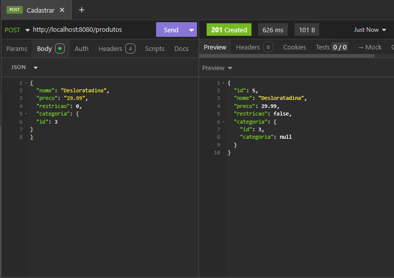
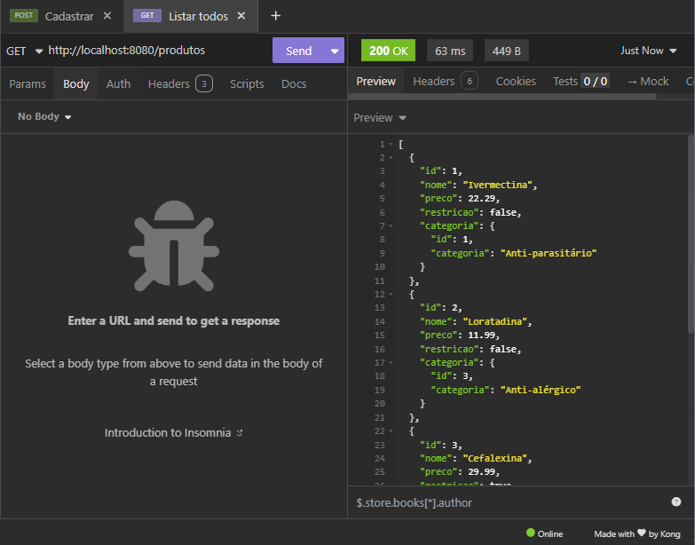

# 🏥 Performance Goal - E-commerce para Farmácia

Este projeto foi desenvolvido como parte do **bootcamp Generation Brasil** e tem como objetivo a criação de um sistema de e-commerce voltado para uma farmácia. O foco está no relacionamento entre tabelas e na implementação de um CRUD completo utilizando boas práticas com Java e Spring Framework.

---

## 🚀 Funcionalidades

- Cadastro, edição, listagem e exclusão de **produtos**.
- Cadastro, edição, listagem e exclusão de **categorias**.
- Relacionamento **N:1** entre produtos e categorias.
- Testes realizados utilizando o **Insomnia** para simular requisições HTTP.

---

## 🛠️ Tecnologias Utilizadas

- Java 21
- Spring Boot
- Spring Data JPA
- Insomnia (para testes de API)

---

## 🔧 Requisitos

- [JDK 21](https://www.oracle.com/java/technologies/javase/jdk21-archive-downloads.html) instalado

---

## 🧪 Testes

As rotas foram testadas utilizando o Insomnia. Abaixo exemplos de requisição:

> 🖼️ Requisição POST
> 
> 
> 
>🖼️ Requisição GET - All
> 
> 
> 
> 🖼️ Requisição GET - Nome
> 
> 
> 

---

## 🔗 Diagrama Entidade-Relacionamento (DER)

O **Diagrama Entidade-Relacionamento (DER)** que representa o banco de dados utilizado no projeto pode ser visualizado abaixo:

---

## 👤 Autor

- [Carlos Henrique da Silva Barbosa](https://www.linkedin.com/in/carlos-henrique-da-silva-barbosa-no-linked-in/)

---

## ⚠️ Observações

Este é um projeto de estudo, não voltado para produção. Utilizado para aprendizado prático sobre APIs REST, Spring e modelagem de banco de dados relacional com JPA.

---

